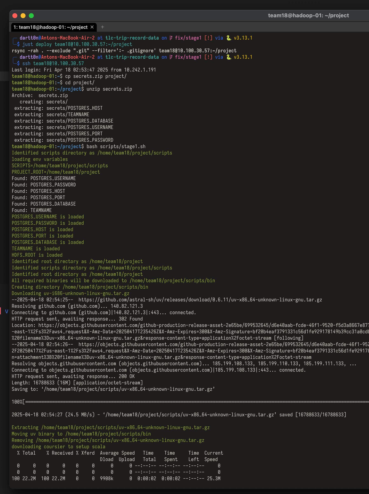
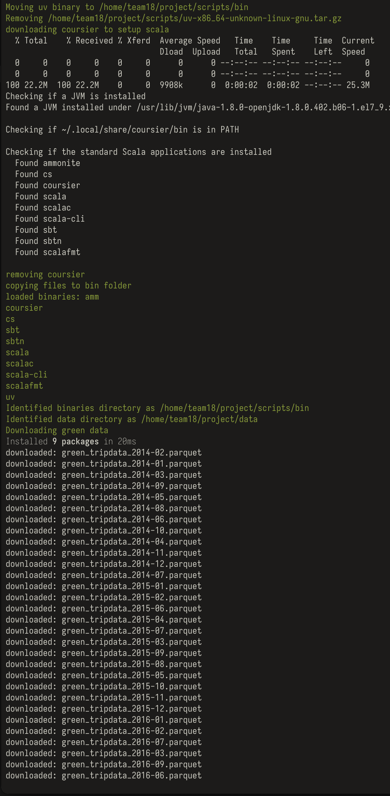
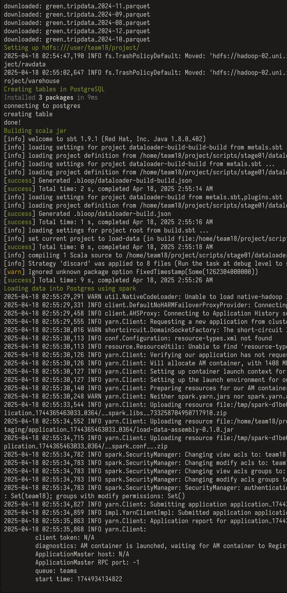
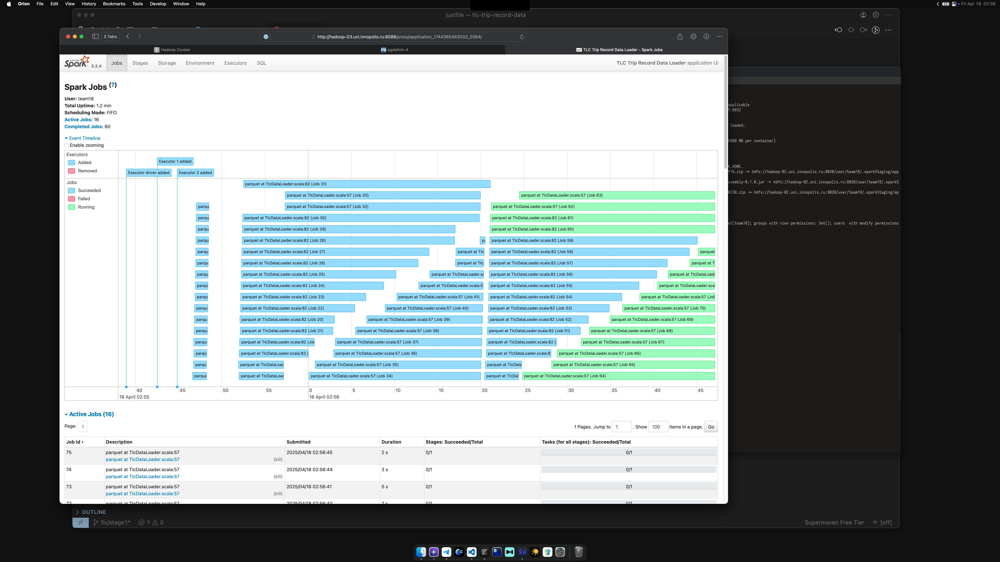
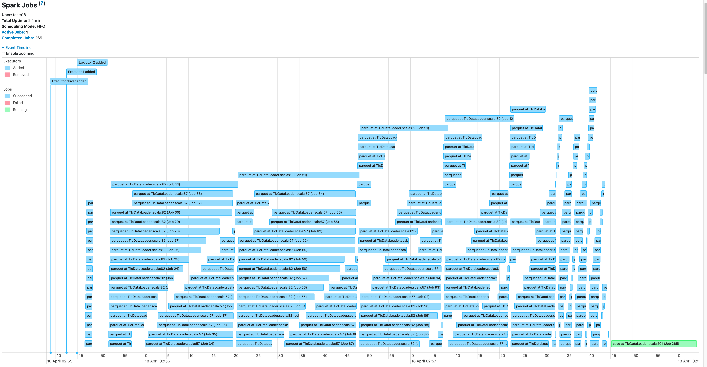
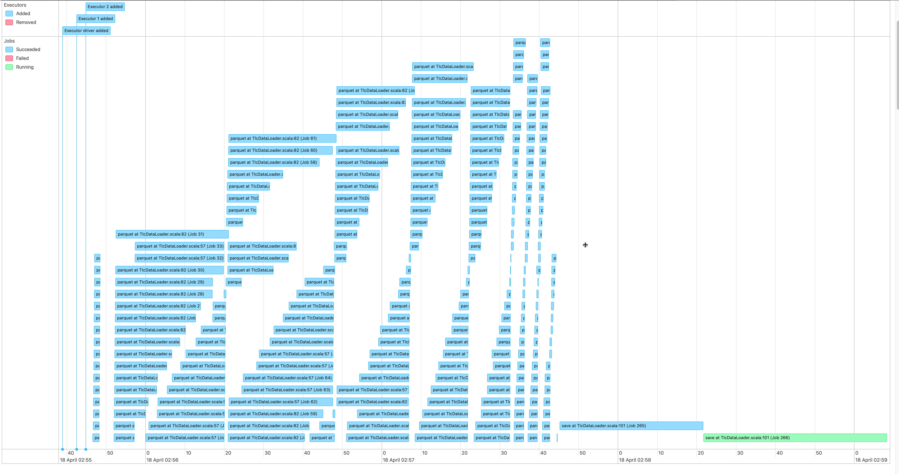
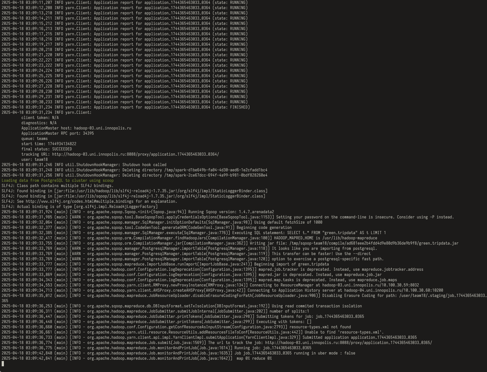
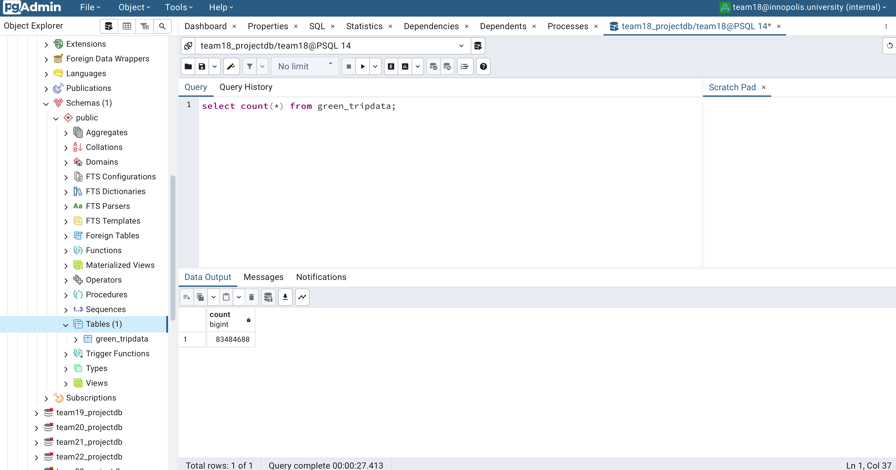
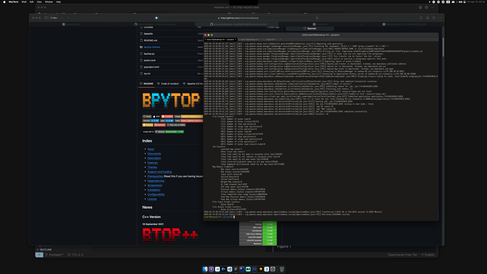
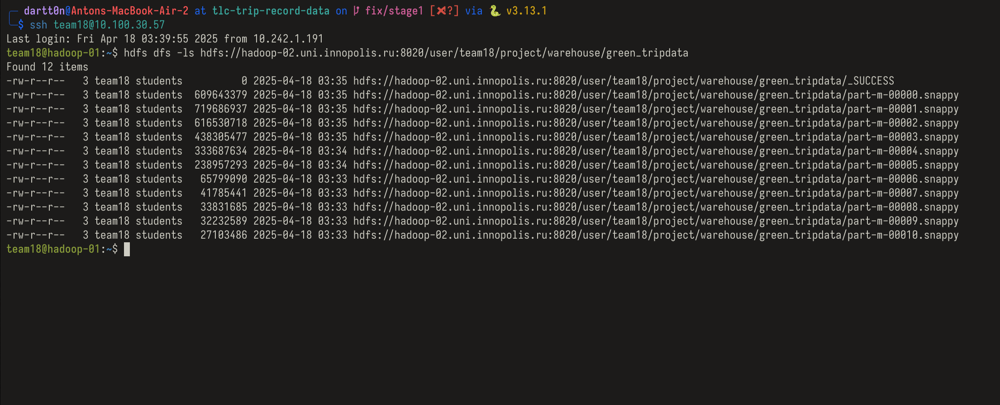

# `[stage01]`

- [`[stage01]`](#stage01)
  - [Development Process](#development-process)
  - [File Structure](#file-structure)
  - [Download dataset](#download-dataset)
  - [Download Script](#download-script)
  - [Index Script](#index-script)
  - [Merge Script](#merge-script)
  - [Create tables](#create-tables)
  - [Dataloader](#dataloader)
  - [DEMO](#demo)

This stage is responsible for collecting data from the source, transforming data into a single format, and injecting it into the database.

## Development Process
For easier development and deployment process, this project uses [uv](https://github.com/astral-sh/uv) tool for Python scripts and [sbt](https://www.scala-sbt.org/) with [assembly plugin](https://github.com/sbt/sbt-assembly) for Scala scripts. Make sure you have installed these tools before continuing development process.
Using `uv` also comes with a advantage of being able to specify script dependencies in the script itself, and executing `uv run script.py` will automatically download all the dependencies and execute the script in the virtual environment.

## File Structure


- `readme.md` - you are here right now
- [`pyproject.toml`](pyproject.toml) - project configuration file
- [`uv.lcok`](uv.lock) - lock file for project dependencies
- [`download/`](download/)
  - [`download_sources.py`](download/download_sources.py) - script for downloading dataset files
  -  [`readme.md`](download/readme.md) - script technical description
- [`index/`](index/)
  -  [`templates/`](index/templates/) - [Jinja2](https://jinja.palletsprojects.com) template files for generating report
        -  [`template.html`](index/templates/template.html) - html 
        -  [`template.md`](index/templates/template.md) - markdown
        -  [`template.typ`](index/templates/template.typ) - [typst](https://typst.app/)
  - [`index.py`](index/index.py) - script for generating report
  - [`readme.md`](index/readme.md) - script technical description
- [`merge/`](merge/)
  - [`merge_parquets.py`](merge/merge_parquets.py) - script for merging dataset files on single machine using polars
  - [`readme.md`](merge/readme.md) - script technical description
- [`dataloader/`](dataloader/) - scala project with spark application for performing distributed data loading
  - [`build.sbt`](dataloader/build.sbt) - sbt build file
  - [`readme.md`](dataloader/readme.md) - project technical description

## Download dataset

We have manually downloaded all the dataset files from the source and have putted them in the Yandex Cloud Object Storage. Yandex Cloud object is configured that way, so it's content publicly available for download, however, manipulation actions are limited to our team members. We have also set up a website for hosting generated index of the dataset, which is available at the following URLs:
1. [bigdata.inno.dartt0n.ru](https://bigdata.inno.dartt0n.ru)
2. [dartt0n.website.yandexcloud.net](https://dartt0n.website.yandexcloud.net/ibd/index.html)

For downloading the dataset files, you can use the following URL:
- https://storage.yandexcloud.net/dartt0n/ibd/green_tripdata_{year}-{month}.parquet

where:
- `{year}` - year of the dataset file in YYYY format
- `{month}` - month of the dataset file in MM format

For example, to download the dataset file for March 2024, you can use the following URL:
- [https://storage.yandexcloud.net/dartt0n/ibd/green_tripdata_2024-03.parquet](https://storage.yandexcloud.net/dartt0n/ibd/green_tripdata_2024-03.parquet)

## Download Script

However, since 10 years of monthly data is exactly 120 files, downloading them manually is not a good idea. Therefore, we have created a script, which downloads all files from the bucket (by specifying range of years and months) and stores them in the local file system for further processing.

This script is available in the [download/download_sources.py](download/download_sources.py) file.

This script has the following arguments:
- `--base-url` - base URL for downloading files
- `--max-concurrent` - maximum number of concurrent downloads
- `--start-year` - start year for data download
- `--end-year` - end year for data download (inclusive)
- `--start-month` - start month for data download
- `--end-month` - end month for data download (inclusive)
- `--file-prefix` - prefix for downloaded files
- `--file-extension` - file extension for downloaded files
- `--output-dir` - directory to save downloaded files

You can access the help message for the script by running the following command:
```bash
$ uv run download/download_sources.py --help

usage: download_sources.py [-h] [--base-url BASE_URL] [--max-concurrent MAX_CONCURRENT] [--start-year START_YEAR] [--end-year END_YEAR]
                           [--start-month START_MONTH] [--end-month END_MONTH] [--file-prefix FILE_PREFIX] [--file-extension FILE_EXTENSION]
                           [--output-dir OUTPUT_DIR]

Download NYC taxi trip data.

options:
  -h, --help            show this help message and exit
  --base-url BASE_URL   Base URL for downloading files
  --max-concurrent MAX_CONCURRENT
                        Maximum number of concurrent downloads
  --start-year START_YEAR
                        Start year for data download
  --end-year END_YEAR   End year for data download (inclusive)
  --start-month START_MONTH
                        Start month for data download
  --end-month END_MONTH
                        End month for data download (inclusive)
  --file-prefix FILE_PREFIX
                        Prefix for downloaded files
  --file-extension FILE_EXTENSION
                        File extension for downloaded files
  --output-dir OUTPUT_DIR
                        Directory to save downloaded files
```

Example of the running the script would be:
```bash
uv run download_sources.py \
    --base-url https://storage.yandexcloud.net/dartt0n/ibd/ \
    --start-year 2014 \
    --end-year 2024 \
    --start-month 1 \
    --end-month 12 \
    --file-prefix green_tripdata \
    --file-extension parquet \
    --output-dir ./data
```
This example downloads all the files from January 2014 to December 2024 from the bucket and saves them in the `./data` directory.

You can read technical details of the script in the [download/readme.md](download/readme.md) file.

## Index Script

After downloading the dataset files, we have created an index of the dataset. This index is available at the following URL:
- [https://bigdata.inno.dartt0n.ru/ibd/index.html](https://bigdata.inno.dartt0n.ru/ibd/index.html)

The indexing script also reads number of rows in each parquet file using `pyarrow` and calculates the total number of rows in the dataset.

The script also support generating index in the [typst](https://typst.app/) and Markdown formats.

The index scripts has the following arguments:
- `--source-dir` - source directory for dataset files
- `--output-format` - output format for the index, can be `html`, `markdown` or `typst`
- `--output-file` - output file path
- `--summary` - whether to include summary row with totals
- `--replace-root` - replace root for download links

You can access the help message for the script by running the following command:
```bash
$ uv run index/generate_index.py --help

Generate report from parquet files.

options:
  -h, --help            show this help message and exit
  --source-dir SOURCE_DIR
                        Directory containing parquet files
  --output-format {html,markdown,typst}
                        Output format: html, markdown or typst
  --output-file OUTPUT_FILE
                        Output file path
  --summary             Include summary row with totals
  --replace-root REPLACE_ROOT
```

Example of the running the script would be:
```bash
uv run index/generate_index.py \
    --source-dir data \
    --output-format html \
    --output-file index.html \
    --summary \
    --replace-root https://bigdata.inno.dartt0n.ru/ibd/
```

You can read technical details of the script in the [index/readme.md](index/readme.md) file.

<details>
<summary>Click here to see example of generated index in markdown format</summary>


| year      | month | size (mb)  | rows         | file                                                                                                         |
|-----------|-------|------------|--------------|--------------------------------------------------------------------------------------------------------------|
| 2014      | 01    | 11.8       | 803860       | [green_tripdata_2014-01.parquet](https://dartt0n.website.yandexcloud.net/ibd/green_tripdata_2014-01.parquet) |
| 2014      | 02    | 14.5       | 1005242      | [green_tripdata_2014-02.parquet](https://dartt0n.website.yandexcloud.net/ibd/green_tripdata_2014-02.parquet) |
| 2014      | 03    | 18.5       | 1293471      | [green_tripdata_2014-03.parquet](https://dartt0n.website.yandexcloud.net/ibd/green_tripdata_2014-03.parquet) |
| 2014      | 04    | 18.7       | 1309155      | [green_tripdata_2014-04.parquet](https://dartt0n.website.yandexcloud.net/ibd/green_tripdata_2014-04.parquet) |
| 2014      | 05    | 20.3       | 1421503      | [green_tripdata_2014-05.parquet](https://dartt0n.website.yandexcloud.net/ibd/green_tripdata_2014-05.parquet) |
| 2014      | 06    | 19.3       | 1337759      | [green_tripdata_2014-06.parquet](https://dartt0n.website.yandexcloud.net/ibd/green_tripdata_2014-06.parquet) |
| 2014      | 07    | 18.3       | 1273973      | [green_tripdata_2014-07.parquet](https://dartt0n.website.yandexcloud.net/ibd/green_tripdata_2014-07.parquet) |
| 2014      | 08    | 19.3       | 1344941      | [green_tripdata_2014-08.parquet](https://dartt0n.website.yandexcloud.net/ibd/green_tripdata_2014-08.parquet) |
| 2014      | 09    | 19.6       | 1361893      | [green_tripdata_2014-09.parquet](https://dartt0n.website.yandexcloud.net/ibd/green_tripdata_2014-09.parquet) |
| 2014      | 10    | 21.2       | 1491266      | [green_tripdata_2014-10.parquet](https://dartt0n.website.yandexcloud.net/ibd/green_tripdata_2014-10.parquet) |
| 2014      | 11    | 22.0       | 1548159      | [green_tripdata_2014-11.parquet](https://dartt0n.website.yandexcloud.net/ibd/green_tripdata_2014-11.parquet) |
| 2014      | 12    | 23.3       | 1645787      | [green_tripdata_2014-12.parquet](https://dartt0n.website.yandexcloud.net/ibd/green_tripdata_2014-12.parquet) |
| 2015      | 01    | 21.7       | 1508493      | [green_tripdata_2015-01.parquet](https://dartt0n.website.yandexcloud.net/ibd/green_tripdata_2015-01.parquet) |
| 2015      | 02    | 22.5       | 1574830      | [green_tripdata_2015-02.parquet](https://dartt0n.website.yandexcloud.net/ibd/green_tripdata_2015-02.parquet) |
| 2015      | 03    | 24.7       | 1722574      | [green_tripdata_2015-03.parquet](https://dartt0n.website.yandexcloud.net/ibd/green_tripdata_2015-03.parquet) |
| 2015      | 04    | 23.9       | 1664394      | [green_tripdata_2015-04.parquet](https://dartt0n.website.yandexcloud.net/ibd/green_tripdata_2015-04.parquet) |
| 2015      | 05    | 25.5       | 1786848      | [green_tripdata_2015-05.parquet](https://dartt0n.website.yandexcloud.net/ibd/green_tripdata_2015-05.parquet) |
| 2015      | 06    | 23.6       | 1638868      | [green_tripdata_2015-06.parquet](https://dartt0n.website.yandexcloud.net/ibd/green_tripdata_2015-06.parquet) |
| 2015      | 07    | 22.3       | 1541671      | [green_tripdata_2015-07.parquet](https://dartt0n.website.yandexcloud.net/ibd/green_tripdata_2015-07.parquet) |
| 2015      | 08    | 22.2       | 1532343      | [green_tripdata_2015-08.parquet](https://dartt0n.website.yandexcloud.net/ibd/green_tripdata_2015-08.parquet) |
| 2015      | 09    | 21.7       | 1494927      | [green_tripdata_2015-09.parquet](https://dartt0n.website.yandexcloud.net/ibd/green_tripdata_2015-09.parquet) |
| 2015      | 10    | 23.5       | 1630536      | [green_tripdata_2015-10.parquet](https://dartt0n.website.yandexcloud.net/ibd/green_tripdata_2015-10.parquet) |
| 2015      | 11    | 22.1       | 1529984      | [green_tripdata_2015-11.parquet](https://dartt0n.website.yandexcloud.net/ibd/green_tripdata_2015-11.parquet) |
| 2015      | 12    | 23.2       | 1608297      | [green_tripdata_2015-12.parquet](https://dartt0n.website.yandexcloud.net/ibd/green_tripdata_2015-12.parquet) |
| 2016      | 01    | 21.1       | 1445292      | [green_tripdata_2016-01.parquet](https://dartt0n.website.yandexcloud.net/ibd/green_tripdata_2016-01.parquet) |
| 2016      | 02    | 21.7       | 1510722      | [green_tripdata_2016-02.parquet](https://dartt0n.website.yandexcloud.net/ibd/green_tripdata_2016-02.parquet) |
| 2016      | 03    | 22.7       | 1576393      | [green_tripdata_2016-03.parquet](https://dartt0n.website.yandexcloud.net/ibd/green_tripdata_2016-03.parquet) |
| 2016      | 04    | 22.3       | 1543926      | [green_tripdata_2016-04.parquet](https://dartt0n.website.yandexcloud.net/ibd/green_tripdata_2016-04.parquet) |
| 2016      | 05    | 22.4       | 1536979      | [green_tripdata_2016-05.parquet](https://dartt0n.website.yandexcloud.net/ibd/green_tripdata_2016-05.parquet) |
| 2016      | 06    | 20.5       | 1404727      | [green_tripdata_2016-06.parquet](https://dartt0n.website.yandexcloud.net/ibd/green_tripdata_2016-06.parquet) |
| 2016      | 07    | 19.6       | 1332510      | [green_tripdata_2016-07.parquet](https://dartt0n.website.yandexcloud.net/ibd/green_tripdata_2016-07.parquet) |
| 2016      | 08    | 18.4       | 1247675      | [green_tripdata_2016-08.parquet](https://dartt0n.website.yandexcloud.net/ibd/green_tripdata_2016-08.parquet) |
| 2016      | 09    | 17.2       | 1162373      | [green_tripdata_2016-09.parquet](https://dartt0n.website.yandexcloud.net/ibd/green_tripdata_2016-09.parquet) |
| 2016      | 10    | 18.4       | 1252572      | [green_tripdata_2016-10.parquet](https://dartt0n.website.yandexcloud.net/ibd/green_tripdata_2016-10.parquet) |
| 2016      | 11    | 17.0       | 1148214      | [green_tripdata_2016-11.parquet](https://dartt0n.website.yandexcloud.net/ibd/green_tripdata_2016-11.parquet) |
| 2016      | 12    | 17.9       | 1224158      | [green_tripdata_2016-12.parquet](https://dartt0n.website.yandexcloud.net/ibd/green_tripdata_2016-12.parquet) |
| 2017      | 01    | 15.9       | 1069565      | [green_tripdata_2017-01.parquet](https://dartt0n.website.yandexcloud.net/ibd/green_tripdata_2017-01.parquet) |
| 2017      | 02    | 15.1       | 1022313      | [green_tripdata_2017-02.parquet](https://dartt0n.website.yandexcloud.net/ibd/green_tripdata_2017-02.parquet) |
| 2017      | 03    | 16.9       | 1157827      | [green_tripdata_2017-03.parquet](https://dartt0n.website.yandexcloud.net/ibd/green_tripdata_2017-03.parquet) |
| 2017      | 04    | 16.0       | 1080844      | [green_tripdata_2017-04.parquet](https://dartt0n.website.yandexcloud.net/ibd/green_tripdata_2017-04.parquet) |
| 2017      | 05    | 15.7       | 1059463      | [green_tripdata_2017-05.parquet](https://dartt0n.website.yandexcloud.net/ibd/green_tripdata_2017-05.parquet) |
| 2017      | 06    | 14.6       | 976467       | [green_tripdata_2017-06.parquet](https://dartt0n.website.yandexcloud.net/ibd/green_tripdata_2017-06.parquet) |
| 2017      | 07    | 13.8       | 914783       | [green_tripdata_2017-07.parquet](https://dartt0n.website.yandexcloud.net/ibd/green_tripdata_2017-07.parquet) |
| 2017      | 08    | 13.1       | 867407       | [green_tripdata_2017-08.parquet](https://dartt0n.website.yandexcloud.net/ibd/green_tripdata_2017-08.parquet) |
| 2017      | 09    | 13.4       | 882464       | [green_tripdata_2017-09.parquet](https://dartt0n.website.yandexcloud.net/ibd/green_tripdata_2017-09.parquet) |
| 2017      | 10    | 13.9       | 925737       | [green_tripdata_2017-10.parquet](https://dartt0n.website.yandexcloud.net/ibd/green_tripdata_2017-10.parquet) |
| 2017      | 11    | 13.2       | 874173       | [green_tripdata_2017-11.parquet](https://dartt0n.website.yandexcloud.net/ibd/green_tripdata_2017-11.parquet) |
| 2017      | 12    | 13.6       | 906016       | [green_tripdata_2017-12.parquet](https://dartt0n.website.yandexcloud.net/ibd/green_tripdata_2017-12.parquet) |
| 2018      | 01    | 12.0       | 792744       | [green_tripdata_2018-01.parquet](https://dartt0n.website.yandexcloud.net/ibd/green_tripdata_2018-01.parquet) |
| 2018      | 02    | 11.7       | 769197       | [green_tripdata_2018-02.parquet](https://dartt0n.website.yandexcloud.net/ibd/green_tripdata_2018-02.parquet) |
| 2018      | 03    | 12.7       | 836246       | [green_tripdata_2018-03.parquet](https://dartt0n.website.yandexcloud.net/ibd/green_tripdata_2018-03.parquet) |
| 2018      | 04    | 12.2       | 799383       | [green_tripdata_2018-04.parquet](https://dartt0n.website.yandexcloud.net/ibd/green_tripdata_2018-04.parquet) |
| 2018      | 05    | 12.2       | 796552       | [green_tripdata_2018-05.parquet](https://dartt0n.website.yandexcloud.net/ibd/green_tripdata_2018-05.parquet) |
| 2018      | 06    | 11.4       | 738546       | [green_tripdata_2018-06.parquet](https://dartt0n.website.yandexcloud.net/ibd/green_tripdata_2018-06.parquet) |
| 2018      | 07    | 10.7       | 684374       | [green_tripdata_2018-07.parquet](https://dartt0n.website.yandexcloud.net/ibd/green_tripdata_2018-07.parquet) |
| 2018      | 08    | 10.5       | 675815       | [green_tripdata_2018-08.parquet](https://dartt0n.website.yandexcloud.net/ibd/green_tripdata_2018-08.parquet) |
| 2018      | 09    | 10.7       | 682032       | [green_tripdata_2018-09.parquet](https://dartt0n.website.yandexcloud.net/ibd/green_tripdata_2018-09.parquet) |
| 2018      | 10    | 11.4       | 731888       | [green_tripdata_2018-10.parquet](https://dartt0n.website.yandexcloud.net/ibd/green_tripdata_2018-10.parquet) |
| 2018      | 11    | 10.6       | 673287       | [green_tripdata_2018-11.parquet](https://dartt0n.website.yandexcloud.net/ibd/green_tripdata_2018-11.parquet) |
| 2018      | 12    | 11.2       | 719654       | [green_tripdata_2018-12.parquet](https://dartt0n.website.yandexcloud.net/ibd/green_tripdata_2018-12.parquet) |
| 2019      | 01    | 10.6       | 672105       | [green_tripdata_2019-01.parquet](https://dartt0n.website.yandexcloud.net/ibd/green_tripdata_2019-01.parquet) |
| 2019      | 02    | 9.8        | 615594       | [green_tripdata_2019-02.parquet](https://dartt0n.website.yandexcloud.net/ibd/green_tripdata_2019-02.parquet) |
| 2019      | 03    | 10.3       | 643063       | [green_tripdata_2019-03.parquet](https://dartt0n.website.yandexcloud.net/ibd/green_tripdata_2019-03.parquet) |
| 2019      | 04    | 9.0        | 567852       | [green_tripdata_2019-04.parquet](https://dartt0n.website.yandexcloud.net/ibd/green_tripdata_2019-04.parquet) |
| 2019      | 05    | 8.6        | 545452       | [green_tripdata_2019-05.parquet](https://dartt0n.website.yandexcloud.net/ibd/green_tripdata_2019-05.parquet) |
| 2019      | 06    | 8.2        | 506238       | [green_tripdata_2019-06.parquet](https://dartt0n.website.yandexcloud.net/ibd/green_tripdata_2019-06.parquet) |
| 2019      | 07    | 7.6        | 470743       | [green_tripdata_2019-07.parquet](https://dartt0n.website.yandexcloud.net/ibd/green_tripdata_2019-07.parquet) |
| 2019      | 08    | 7.2        | 449695       | [green_tripdata_2019-08.parquet](https://dartt0n.website.yandexcloud.net/ibd/green_tripdata_2019-08.parquet) |
| 2019      | 09    | 7.3        | 449063       | [green_tripdata_2019-09.parquet](https://dartt0n.website.yandexcloud.net/ibd/green_tripdata_2019-09.parquet) |
| 2019      | 10    | 7.5        | 476386       | [green_tripdata_2019-10.parquet](https://dartt0n.website.yandexcloud.net/ibd/green_tripdata_2019-10.parquet) |
| 2019      | 11    | 7.2        | 449500       | [green_tripdata_2019-11.parquet](https://dartt0n.website.yandexcloud.net/ibd/green_tripdata_2019-11.parquet) |
| 2019      | 12    | 7.2        | 455294       | [green_tripdata_2019-12.parquet](https://dartt0n.website.yandexcloud.net/ibd/green_tripdata_2019-12.parquet) |
| 2020      | 01    | 6.9        | 447770       | [green_tripdata_2020-01.parquet](https://dartt0n.website.yandexcloud.net/ibd/green_tripdata_2020-01.parquet) |
| 2020      | 02    | 6.3        | 398632       | [green_tripdata_2020-02.parquet](https://dartt0n.website.yandexcloud.net/ibd/green_tripdata_2020-02.parquet) |
| 2020      | 03    | 3.8        | 223496       | [green_tripdata_2020-03.parquet](https://dartt0n.website.yandexcloud.net/ibd/green_tripdata_2020-03.parquet) |
| 2020      | 04    | 0.7        | 35644        | [green_tripdata_2020-04.parquet](https://dartt0n.website.yandexcloud.net/ibd/green_tripdata_2020-04.parquet) |
| 2020      | 05    | 1.0        | 57361        | [green_tripdata_2020-05.parquet](https://dartt0n.website.yandexcloud.net/ibd/green_tripdata_2020-05.parquet) |
| 2020      | 06    | 1.1        | 63110        | [green_tripdata_2020-06.parquet](https://dartt0n.website.yandexcloud.net/ibd/green_tripdata_2020-06.parquet) |
| 2020      | 07    | 1.2        | 72258        | [green_tripdata_2020-07.parquet](https://dartt0n.website.yandexcloud.net/ibd/green_tripdata_2020-07.parquet) |
| 2020      | 08    | 1.4        | 81063        | [green_tripdata_2020-08.parquet](https://dartt0n.website.yandexcloud.net/ibd/green_tripdata_2020-08.parquet) |
| 2020      | 09    | 1.5        | 87987        | [green_tripdata_2020-09.parquet](https://dartt0n.website.yandexcloud.net/ibd/green_tripdata_2020-09.parquet) |
| 2020      | 10    | 1.7        | 95120        | [green_tripdata_2020-10.parquet](https://dartt0n.website.yandexcloud.net/ibd/green_tripdata_2020-10.parquet) |
| 2020      | 11    | 1.5        | 88605        | [green_tripdata_2020-11.parquet](https://dartt0n.website.yandexcloud.net/ibd/green_tripdata_2020-11.parquet) |
| 2020      | 12    | 1.4        | 83130        | [green_tripdata_2020-12.parquet](https://dartt0n.website.yandexcloud.net/ibd/green_tripdata_2020-12.parquet) |
| 2021      | 01    | 1.3        | 76518        | [green_tripdata_2021-01.parquet](https://dartt0n.website.yandexcloud.net/ibd/green_tripdata_2021-01.parquet) |
| 2021      | 02    | 1.1        | 64572        | [green_tripdata_2021-02.parquet](https://dartt0n.website.yandexcloud.net/ibd/green_tripdata_2021-02.parquet) |
| 2021      | 03    | 1.4        | 83827        | [green_tripdata_2021-03.parquet](https://dartt0n.website.yandexcloud.net/ibd/green_tripdata_2021-03.parquet) |
| 2021      | 04    | 1.5        | 86941        | [green_tripdata_2021-04.parquet](https://dartt0n.website.yandexcloud.net/ibd/green_tripdata_2021-04.parquet) |
| 2021      | 05    | 1.6        | 88180        | [green_tripdata_2021-05.parquet](https://dartt0n.website.yandexcloud.net/ibd/green_tripdata_2021-05.parquet) |
| 2021      | 06    | 1.6        | 86737        | [green_tripdata_2021-06.parquet](https://dartt0n.website.yandexcloud.net/ibd/green_tripdata_2021-06.parquet) |
| 2021      | 07    | 1.5        | 83691        | [green_tripdata_2021-07.parquet](https://dartt0n.website.yandexcloud.net/ibd/green_tripdata_2021-07.parquet) |
| 2021      | 08    | 1.5        | 83499        | [green_tripdata_2021-08.parquet](https://dartt0n.website.yandexcloud.net/ibd/green_tripdata_2021-08.parquet) |
| 2021      | 09    | 1.8        | 95709        | [green_tripdata_2021-09.parquet](https://dartt0n.website.yandexcloud.net/ibd/green_tripdata_2021-09.parquet) |
| 2021      | 10    | 2.1        | 110891       | [green_tripdata_2021-10.parquet](https://dartt0n.website.yandexcloud.net/ibd/green_tripdata_2021-10.parquet) |
| 2021      | 11    | 2.0        | 108229       | [green_tripdata_2021-11.parquet](https://dartt0n.website.yandexcloud.net/ibd/green_tripdata_2021-11.parquet) |
| 2021      | 12    | 1.9        | 99961        | [green_tripdata_2021-12.parquet](https://dartt0n.website.yandexcloud.net/ibd/green_tripdata_2021-12.parquet) |
| 2022      | 01    | 1.2        | 62495        | [green_tripdata_2022-01.parquet](https://dartt0n.website.yandexcloud.net/ibd/green_tripdata_2022-01.parquet) |
| 2022      | 02    | 1.4        | 69399        | [green_tripdata_2022-02.parquet](https://dartt0n.website.yandexcloud.net/ibd/green_tripdata_2022-02.parquet) |
| 2022      | 03    | 1.5        | 78537        | [green_tripdata_2022-03.parquet](https://dartt0n.website.yandexcloud.net/ibd/green_tripdata_2022-03.parquet) |
| 2022      | 04    | 1.5        | 76136        | [green_tripdata_2022-04.parquet](https://dartt0n.website.yandexcloud.net/ibd/green_tripdata_2022-04.parquet) |
| 2022      | 05    | 1.5        | 76891        | [green_tripdata_2022-05.parquet](https://dartt0n.website.yandexcloud.net/ibd/green_tripdata_2022-05.parquet) |
| 2022      | 06    | 1.5        | 73718        | [green_tripdata_2022-06.parquet](https://dartt0n.website.yandexcloud.net/ibd/green_tripdata_2022-06.parquet) |
| 2022      | 07    | 1.3        | 64192        | [green_tripdata_2022-07.parquet](https://dartt0n.website.yandexcloud.net/ibd/green_tripdata_2022-07.parquet) |
| 2022      | 08    | 1.3        | 65929        | [green_tripdata_2022-08.parquet](https://dartt0n.website.yandexcloud.net/ibd/green_tripdata_2022-08.parquet) |
| 2022      | 09    | 1.4        | 69031        | [green_tripdata_2022-09.parquet](https://dartt0n.website.yandexcloud.net/ibd/green_tripdata_2022-09.parquet) |
| 2022      | 10    | 1.4        | 69322        | [green_tripdata_2022-10.parquet](https://dartt0n.website.yandexcloud.net/ibd/green_tripdata_2022-10.parquet) |
| 2022      | 11    | 1.2        | 62313        | [green_tripdata_2022-11.parquet](https://dartt0n.website.yandexcloud.net/ibd/green_tripdata_2022-11.parquet) |
| 2022      | 12    | 1.4        | 72439        | [green_tripdata_2022-12.parquet](https://dartt0n.website.yandexcloud.net/ibd/green_tripdata_2022-12.parquet) |
| 2023      | 01    | 1.4        | 68211        | [green_tripdata_2023-01.parquet](https://dartt0n.website.yandexcloud.net/ibd/green_tripdata_2023-01.parquet) |
| 2023      | 02    | 1.5        | 64809        | [green_tripdata_2023-02.parquet](https://dartt0n.website.yandexcloud.net/ibd/green_tripdata_2023-02.parquet) |
| 2023      | 03    | 1.7        | 72044        | [green_tripdata_2023-03.parquet](https://dartt0n.website.yandexcloud.net/ibd/green_tripdata_2023-03.parquet) |
| 2023      | 04    | 1.5        | 65392        | [green_tripdata_2023-04.parquet](https://dartt0n.website.yandexcloud.net/ibd/green_tripdata_2023-04.parquet) |
| 2023      | 05    | 1.6        | 69174        | [green_tripdata_2023-05.parquet](https://dartt0n.website.yandexcloud.net/ibd/green_tripdata_2023-05.parquet) |
| 2023      | 06    | 1.5        | 65550        | [green_tripdata_2023-06.parquet](https://dartt0n.website.yandexcloud.net/ibd/green_tripdata_2023-06.parquet) |
| 2023      | 07    | 1.4        | 61343        | [green_tripdata_2023-07.parquet](https://dartt0n.website.yandexcloud.net/ibd/green_tripdata_2023-07.parquet) |
| 2023      | 08    | 1.4        | 60649        | [green_tripdata_2023-08.parquet](https://dartt0n.website.yandexcloud.net/ibd/green_tripdata_2023-08.parquet) |
| 2023      | 09    | 1.5        | 65471        | [green_tripdata_2023-09.parquet](https://dartt0n.website.yandexcloud.net/ibd/green_tripdata_2023-09.parquet) |
| 2023      | 10    | 1.5        | 66177        | [green_tripdata_2023-10.parquet](https://dartt0n.website.yandexcloud.net/ibd/green_tripdata_2023-10.parquet) |
| 2023      | 11    | 1.5        | 64025        | [green_tripdata_2023-11.parquet](https://dartt0n.website.yandexcloud.net/ibd/green_tripdata_2023-11.parquet) |
| 2023      | 12    | 1.5        | 64215        | [green_tripdata_2023-12.parquet](https://dartt0n.website.yandexcloud.net/ibd/green_tripdata_2023-12.parquet) |
| 2024      | 01    | 1.3        | 56551        | [green_tripdata_2024-01.parquet](https://dartt0n.website.yandexcloud.net/ibd/green_tripdata_2024-01.parquet) |
| 2024      | 02    | 1.2        | 53577        | [green_tripdata_2024-02.parquet](https://dartt0n.website.yandexcloud.net/ibd/green_tripdata_2024-02.parquet) |
| 2024      | 03    | 1.3        | 57457        | [green_tripdata_2024-03.parquet](https://dartt0n.website.yandexcloud.net/ibd/green_tripdata_2024-03.parquet) |
| 2024      | 04    | 1.3        | 56471        | [green_tripdata_2024-04.parquet](https://dartt0n.website.yandexcloud.net/ibd/green_tripdata_2024-04.parquet) |
| 2024      | 05    | 1.4        | 61003        | [green_tripdata_2024-05.parquet](https://dartt0n.website.yandexcloud.net/ibd/green_tripdata_2024-05.parquet) |
| 2024      | 06    | 1.3        | 54748        | [green_tripdata_2024-06.parquet](https://dartt0n.website.yandexcloud.net/ibd/green_tripdata_2024-06.parquet) |
| 2024      | 07    | 1.2        | 51837        | [green_tripdata_2024-07.parquet](https://dartt0n.website.yandexcloud.net/ibd/green_tripdata_2024-07.parquet) |
| 2024      | 08    | 1.2        | 51771        | [green_tripdata_2024-08.parquet](https://dartt0n.website.yandexcloud.net/ibd/green_tripdata_2024-08.parquet) |
| 2024      | 09    | 1.3        | 54440        | [green_tripdata_2024-09.parquet](https://dartt0n.website.yandexcloud.net/ibd/green_tripdata_2024-09.parquet) |
| 2024      | 10    | 1.3        | 56147        | [green_tripdata_2024-10.parquet](https://dartt0n.website.yandexcloud.net/ibd/green_tripdata_2024-10.parquet) |
| 2024      | 11    | 1.2        | 52222        | [green_tripdata_2024-11.parquet](https://dartt0n.website.yandexcloud.net/ibd/green_tripdata_2024-11.parquet) |
| 2024      | 12    | 1.3        | 53994        | [green_tripdata_2024-12.parquet](https://dartt0n.website.yandexcloud.net/ibd/green_tripdata_2024-12.parquet) |
|           |       |            |              |                                                                                                              |
| **total** |       | **1253.6** | **83484688** |                                                                                                              |

</details>

## Merge Script (*Deprecated*)

After downloading the dataset files, we have created a script, which merges all the files into a single parquet file. This script is based upon the [polars](https://www.pola.rs/) library and more specifically on the lazyframe streaming API. This API allows to process the data in a streaming manner, processing chunk by chunk keeping the memory usage low. However, this approach has a major drawback, that the code could be executed only on a single node and therefore limited by computational resources of a single machine.

Merge script has the following arguments:
- `--source-dir` - source directory for dataset files
- `--output-file` - output file path
- `--prefix` - prefix for downloaded files
- `--file-extension` - file extension for downloaded files
- `--compression` - compression type for output parquet file (lz4, uncompressed, snappy, gzip, lzo, brotli, zstd)
- `--compression-level` - compression level. Only available for gzip, brotli, and zstd


You can access the help message for the script by running the following command:
```bash
$ uv run merge/merge_parquets.py --help

                         [--compression {lz4,uncompressed,snappy,gzip,lzo,brotli,zstd}] [--compression-level COMPRESSION_LEVEL]

Generate report from parquet files.

options:
  -h, --help            show this help message and exit
  --source-dir SOURCE_DIR
                        Directory containing parquet files
  --output-file OUTPUT_FILE
                        Output file path
  --prefix PREFIX       Prefix for downloaded files
  --file-extension FILE_EXTENSION
                        File extension for downloaded files
  --compression {lz4,uncompressed,snappy,gzip,lzo,brotli,zstd}
                        Compression type for output parquet file
  --compression-level COMPRESSION_LEVEL
                        Compression level. Only available for gzip, brotli, and zstd
```

Example of the running the script would be:
```bash
uv run merge/merge_parquets.py \
    --source-dir data \
    --output-file merged.parquet \
    --prefix green_tripdata \
    --file-extension parquet \
    --compression zstd \
    --compression-level 22
```

Ypu can read technical details of the script in the [merge/readme.md](merge/readme.md) file.

In the final solution we merge the files using Spark distributed dataframe conversion and merge as separate jobs.

## Create tables

After merging the dataset files, we have created a script, which creates tables in the PostgreSQL database. This script has the following arguments:
- `--host` - host for PostgreSQL
- `--port` - port for PostgreSQL
- `--user` - user for PostgreSQL
- `--password` - password for PostgreSQL
- `--database` - database for PostgreSQL
- `--psql-create-schema` - path to SQL script for creating tables

You can find SQL script for creating tables in the [sql/create-table-psql.sql](../../sql/create-table-psql.sql) file.

You can access the help message for the script by running the following command:
```bash
$ uv run create-tables/create_tables.py --help

usage: create_tables.py [-h] [--host HOST] [--port PORT] [--user USER] [--password PASSWORD] [--database DATABASE] [--psql-create-schema PSQL_CREATE_SCHEMA]

Create tables in PostgreSQL.

options:
  -h, --help            show this help message and exit
  --host HOST           Host for PostgreSQL
  --port PORT           Port for PostgreSQL
  --user USER           User for PostgreSQL
  --password PASSWORD   Password for PostgreSQL
  --database DATABASE   Database for PostgreSQL
  --psql-create-schema PSQL_CREATE_SCHEMA
```

Example of the running the script would be:
```bash
uv run create-tables/create_tables.py \
    --host localhost \
    --port 5432 \
    --user postgres \
    --password postgres \
    --database postgres \
    --psql-create-schema sql/create-table-psql.sql
```

You can read technical details of the script in the [create-tables/readme.md](create-tables/readme.md) file.

## Dataloader

Dataloader is a scala project with spark application for performing distributed data loading. Performs according to the following algorithm:
1. Lists an input directory to find all parquet files
2. Spawn a spark job for each parquet file
3. In each job, it reads the parquet file, converts all column to correct data type, and partitions the data into year and month
   - Partitions are saved in `/user/team18/project/data/year={year:04d}/month={month:02d}/...`
4. Then it spawn a job to collect all partitioned data and load them into PostgreSQL

Dataloader has the following arguments:
- `--host` - host for PostgreSQL
- `--port` - port for PostgreSQL
- `--user` - user for PostgreSQL
- `--password` - password for PostgreSQL
- `--database` - database for PostgreSQL
- `--table` - table name for PostgreSQL
- `--source` - source directory for dataset files
- `--merged` - directory for merged partitioned dataset files

Example of the running the script would be:
```bash
spark-submit \
    --master yarn \
    --deploy-mode cluster \
    --class tlcdataloader.TlcDataLoader \
    target/scala-2.12/load-data-assembly-0.1.0.jar \
    --host localhost \
    --port 5432 \
    --username postgres \
    --password postgres \
    --database postgres \
    --table green_tripdata \
    --source "/user/team18/project/rawdata" \
    --merged "/user/team18/project/data"
```

You can read technical details of the script in the [dataloader/readme.md](dataloader/readme.md) file.

## DEMO



> **Figure 1**
> 
> Deploy process and stage1 script launch. On the screenshot, we can see that scripts loads secrets from the `secrets/` directory and invokes `prepare-bin.sh` script, which downloads all the required binaries and saves them in the `$SCRIPTS/bin/` directory.



> **Figure 2**
>
> Download script execution. On the screenshot, we can see that the script downloads all the files from the source and saves them in the `$PROJECT_ROOT/data/` directory.


> **Figure 3**
>
> Table creation, scala jar built and spark-submit execution. On the screenshot, we can see that the script invokes `create_tables.py` script, which creates tables in the PostgreSQL database. Script also builds `dataloadeer` scala project and invokes `spark-submit` to load the data into PostgreSQL


> **Figure 4**
>
> Dataloader spawns a lot of parallel jobs to process files in the most efficient way.


> **Figure 5**
>
> After processing file, dataloader starts to load data to the PostgreSQL database. This is the most time-consuming part of the script.


> **Figure 6**
>
> But even though, thanks to the spark architecture, even such time-consuming operation can be split into smaller jobs 


> **Figure 7**
>
> Spark successfully loads data into the database, `sqoop` starts to import data from PostgreSQL to HDFS


> **Figure 8**
>
> All the rows are successfully loaded into Postgres


> **Figure 9**
>
> Sqoop successfully finished


> **Figure 10**
>
> Sqoop successfully imports data from Postgres to HDFS


